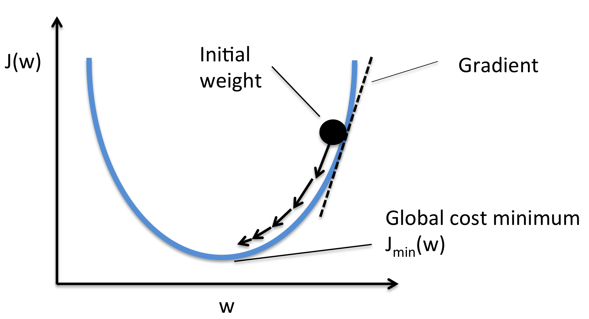
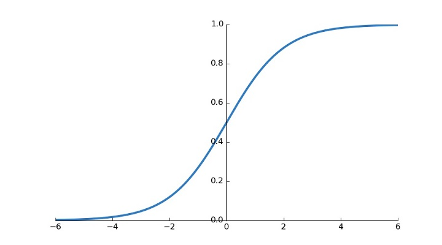

# Studying-DeepLearning
본 Repo는 DeepLearning을 공부한 내용을 간단하게 정리한 Repo이다. 각 챕터별로 동일한 이름을 가진 jupyter notebook file에 해당 챕터 내용에 대한 example code를 작성해 두었다. (ex. 1-1.Gradient_descent_MSE.ipynb)

## 1.Gradient descent
머신러닝의 핵심은 주어진 입력에 대해 의도된 출력이 매칭되는 함수를 도출해 내는 것이다. 가장 간단한 예시로 Y=aX 꼴의 X, Y 데이터 셋이 있을때 해당 함수를 유추하는 것은 a의 값을 유추해 내는 것과 같다. 이를 유추해 내는 가장 대표적인 알고리즘이 Gradient descent 알고리즘이다. Gradient descent 알고리즘은 임의의 a값을 지정해 Y_predicted를 계산 한 뒤 그 계산값을 이용해 실제 Y_target 값에 가깝게 수렴하도록 계산이 진행된다. 이 과정은 먼저 Y_predicted를 주어진 loss function(ex. L2norm)을 사용해 Y_target과의 loss를 계산하고, 이 loss가 최저점이 되는 지점을 찾기 위해 loss의 a(weight)에 대한 변화율을 현재의 a에서 뺀 값을 이후 스텝의 a로 채택한다. 이 알고리즘을 그래프로 간략화 하면 다음과 같다.

### Gradient descent algorithm

## 2.Pytorch, the python-based scientific computing package
Pytorch는 python환경을 기반으로 제공되는 deep learning research platform이다. Pytorch는 deep learning에 필수적인 함수들 말고도 deep learning에 도움이 되는 다양한 모듈들을 지원한다. 기본적으로, 여러 loss Function과 optimizer가 제공되며, 이들은 autograd (ex.back propagation)을 지원한다. 또한 전용 dataset class를 이용하면, num_workers prameter을 수정하여 load시 cpu 사용량을 지정하여 불러올 수 있다. Pytorch optimizer와 loss function, activation function 및 지원되는 다양한 모듈들은 아래의 pytorch 공식 홈페이지를 참고하라.

### Optimizers in pytorch
https://pytorch.org/docs/stable/optim.html

### Loss function and other usefull utilities in pytorch
https://pytorch.org/docs/stable/nn.html

## 3.Regression and Classification
일반적인 deeplearning의 학습 방법은 loss function을 기반으로, input feature에 대한 predict value와 true label의 차이만큼을 gradient descent 방법을 동해 weight를 업데이트 하는 방식이다. 이때 이런 방식으로 update 되는 weight들은 특정 함수를 모방하게 되고, 매 iteration마다 이에 근접하게 되는데 이를 regression이라고 한다. Classification의 경우엔, 수렴의 대상이 되는 함수가 특정 class에 대한 확률 분포를 계산하는 함수로써, regression을 통해 도출된 함수에 softmax와 같은 active function을 거치면서 특정 class를 지칭할 수 있도록 학습된다. Softmax는 2개의 대상을 구분할 수 있는 sigmoid function의 n class version이라고 생각하면 쉽다.

### CIFAR 10

### Sigmoid

## 4.Advanced CNN
Computer vision 영역의 deeplearning에서 가장 대표적으로 쓰이는 네트워크 구조는 CNN이다. 이러한 CNN구조의 성능은 깊이가 깊어질수록 지속적으로 높아져왔다. 그러나 단순히 너무 깊은 네트워크를 설계할경우 쓸모 없는 값에도 과하게 overfitted되거나, gradient vanishing/exploding의 문제가 발생하여 성능이 더 높아지지 않았다. 이러한 문제점을 해결한 아이디어가 바로 ResNet구조이다. ResNet구조는 입력되는 값을 맨 마지막단에 FC(Fooly Connected) layer로 합쳐주면서, 네트워크가 residual을 학습하도록 만들었고 이를 통해 매우 높은 성능향상을 가져왔다.

### ResNet

